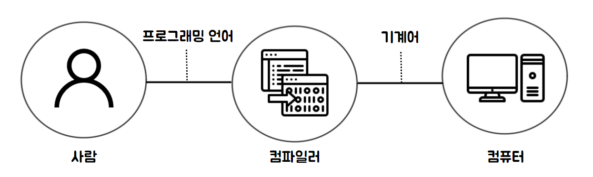

# 01. 프로그래밍

### 1.1 프로그래밍이란? 

프로그래밍이란 컴퓨터에게 실행을 요구하는 일종의 커뮤니케이션입니다. 프로그래밍을 하기에 앞서 해결해야 할 문제(요구사항)를 명확히 이해한 후 적절한 문제 해결 방안을 정의할 필요가 있습니다. 

이때 요구되는 것이 문제 해결 능력입니다. 문제 해결 능력을 알고리즘과 동일시하려는 사람들도 있습니다. 하지만 문제 해결 능력은 알고리즘 학습보다 더 큰 차원의 능력입니다. 

대부분의 문제(요구사항)는 복잡하며 명확하지 않을 수도 있습니다. 따라서 문제(요구사항)를 명확히 이해하는 것이 우선되어야 하며 복잡함을 단순하게 분해하고 자료를 정리하고 구분해야 하며 순서에 맞게 행위를 배열해야 합니다. 

즉, 프로그래밍이랑 0과 1밖에 알지 못하는 기계가 실행할 수 있을 정도로 정확하고 상세하게 요구사항을 설명하는 작업이며, 그 결과물이 바로 코드입니다. 

우리는 문제 해결 방안을 고려할 때 컴퓨터의 입장에서 문제를 바라봐야 합니다. 이때 필요한 것이 Computational thinking(컴퓨터 사고)입니다. 문제 해결 능력은 직감과 직관의 영역이라고 볼 수 있는데, 이는 실생활에서 문제를 경험하는 익숙한 사항에 대해 당연시하는 안이한 인식이 있습니다. 예를 들어 "듣다"라는 행위를 사람은 하나의 간단하고 당연한 기능으로 생각하지만 컴퓨터에게는 이 행위를 설명하는 것은 단순하지 않습니다. 또한 사람마다 "크다", "작다"라는 의미도 상대적이기 때문이 기준이 불명확합니다. 이를 컴퓨터에게 명령할 때에는 양적 개념인 숫자를 사용해 "현재 볼륨보다 1단계 크게 조정하라" 또는 "볼륨을 60으로 조정하라"라고 명령해야 합니다. 

이처럼 컴퓨터와 사람은 사고, 인지의 방식이 다르며 컴퓨터의 관점에서 문제를 사고해야 합니다. 여기에는 논리적, 수학적 사고가 필요하며 해결 과제를 작은 단위로 분해하고 패턴화해서 추출하며, 프로그래밍 내에서 사용될 모든 개념은 평가 가능하도록 정의해야 합니다. 

### 1.2 프로그래밍 언어 

문제 해결 능력을 바탕을 정의된 문제 해결 방안은 컴퓨터에게 전달되어야 합니다. 이때 명령을 수행할 주체는 컴퓨터입니다. 따라서 사람이 이해할 수 있는 자연어가 아니라 컴퓨터가 이해할 수 있는 언어, 즉 기계어로 명령을 전달해야 합니다. 

기계어로 직접 명령을 전달하는 것을 대신할 가장 유용한 대안은 사람이 이해할 수 있는 약속된 구문(syntax)으로 구성된 "프로그래밍 언어"를 사용해 프로그램을 작성한 후 그것을 컴퓨터가 이해할 수 있는 기계어로 변환하는 일종의 번역기를 이용하는 것입니다. 이 일종의 번역기를 컴파일러(compiler) 혹은 인터프리터(interpreter)라고 합니다. 

언어는 자신의 생각을 상대에게 전달하는 방법으로 언어 공동체 내에서 이해될 수 있는 말의 집합니다. 
언어는 자연어와 인공어로 구분할 수 있습니다. 프로그래밍 언어란 컴퓨터와의 대화(명령)에 사용되는 일종의 표현 수단으로, 사함과 컴퓨터(컴파일러 또는 인터프리터) 모두가 이해할 수 있는 약속된 형태의 인공어입니다. 프로그래밍은 프로그래밍 언어를 사용해 컴퓨터에게 실행을 요구하는 일종의 커뮤니케이션입니다. 프로그래밍 언어는 구문(syntax)과 의미(semantics)의 조합으로 표현됩니다. 

### 1.3 구문과 의미

프로그래밍 학습은 일반적으로 프로그래밍 언어의 문법을 배우는 것부터 시작합니다. 이는 외국어 학습과 유사합니다. 외국어를 잘하려면 화자의 말이나 문장을 정확히 이해한 후 문맥에 따른 적절한 어휘 선택, 그리고 순차적으로 결론을 향해 나아가는 문장 구성이 필요합니다. 

MIT의 저명한 언어학자인 노엄 촘스키는 언어의 의미는 문맥에 있는 것이지 문법이 있는 것이 아니라고 말했습니다. 문법적으로 문제도 없고 의미도 없는 문장이 만들어질 수 있다는 것입니다. 

자바스크립트의 변수에는 어떠한 타입의 값도 할당할 수 있습니다. 하지만 이름의 변수에는 숫자를 할당하는 것이 의미적으로 옳다고 할 수 있을 것입니다. 결국 문제 해결 능력을 통해 만들어낸 해결 방안은 프로그래밍 언어의 문법을 사용해 표현합니다. 즉, 작성된 코드는 해결 방안의 구체적 구현물이며, 요구사항이 실현(문제가 해결)되어야 의미가 있습니다. 

결국 프로그래밍은 요구사항의 집합을 분석해서 적절한 자료구조와 함수의 집합으로 변환한 후, 그 흐름을 제어하는 것입니다. 

