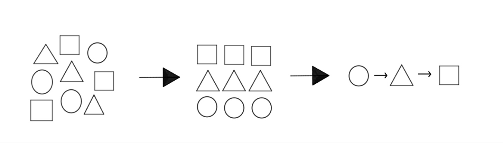

```
---
layout: 모던 자바스크립트 Deep Dive-01
title:  "01. 프로그래밍"
---
```

# 01. 프로그래밍

### 프로그래밍이란? 

프로그래밍이란 컴퓨터에게 실행을 요구하는 일종의 커뮤니케이션입니다. 프로그래밍을 하기에 앞서 해결해야 할 문제(요구사항)를 명확히 이해한 후 적절한 문제 해결 방안을 정의할 필요가 있습니다. 

이때 요구되는 것이 문제 해결 능력입니다. 문제 해결 능력을 알고리즘과 동일시하려는 사람들도 있습니다. 하지만 문제 해결 능력은 알고리즘 학습보다 더 큰 차원의 능력입니다. 

대부분의 문제(요구사항)는 복잡하며 명확하지 않을 수도 있습니다. 따라서 문제(요구사항)를 명확히 이해하는 것이 우선되어야 하며 복잡함을 단순하게 분해하고 자료를 정리하고 구분해야 하며 순서에 맞게 행위를 배열해야 합니다. 




즉, 프로그래밍이랑 0과 1밖에 알지 못하는 기계가 실행할 수 있을 정도로 정확하고 상세하게 요구사항을 설명하는 작업이며, 그 결과물이 바로 코드입니다. 

